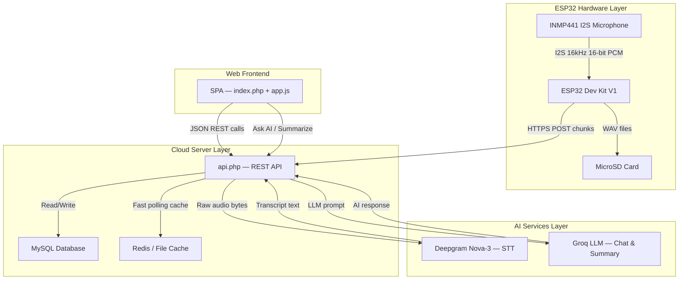
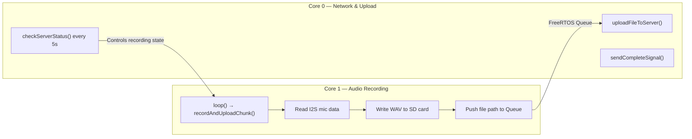
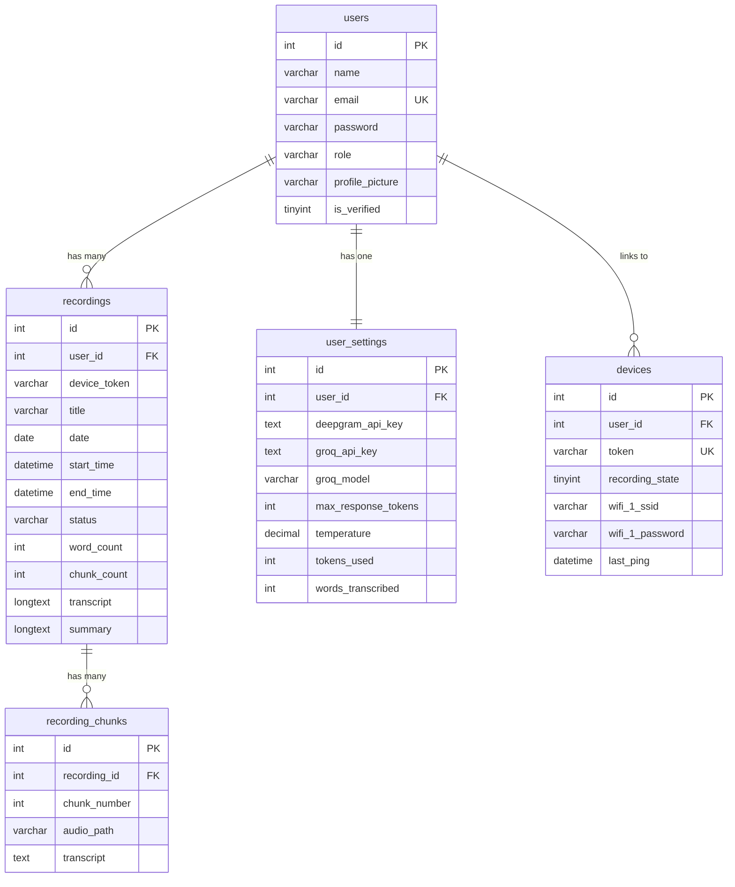
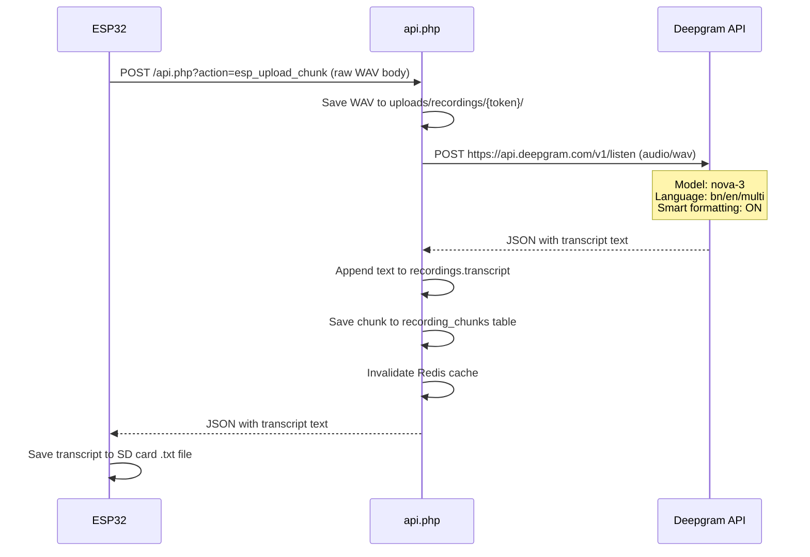
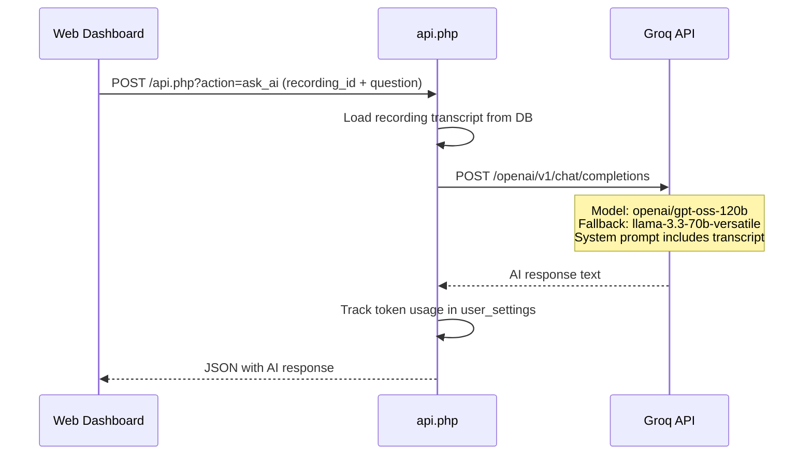
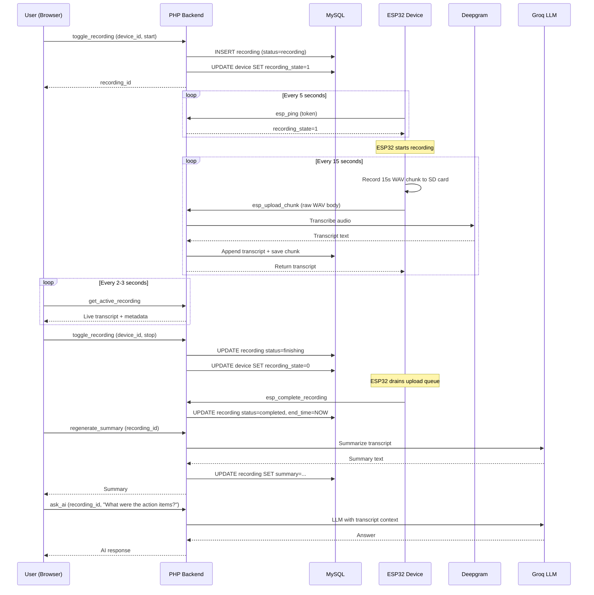

# MythBrain — Complete System Walkthrough

> How audio travels from a physical microphone to an AI-generated meeting summary.

---

## System Architecture Overview



---

## 1. Hardware Layer — ESP32 + INMP441 Microphone

### Physical Components

| Component | Role | Connection |
|-----------|------|------------|
| **ESP32 Dev Kit V1** | Main microcontroller (dual-core, WiFi) | — |
| **INMP441** | I2S MEMS microphone (captures voice) | GPIO 14 (SCK), GPIO 15 (WS), GPIO 32 (SD) |
| **MicroSD Card Module** | Local audio file storage buffer | SPI: GPIO 18 (SCK), GPIO 19 (MISO), GPIO 23 (MOSI), GPIO 5 (CS) |

### Wiring Diagram (Pin Map)

```
INMP441 Mic          ESP32
─────────            ─────
SCK  ──────────────> GPIO 14
WS   ──────────────> GPIO 15
SD   ──────────────> GPIO 32
L/R  ──────────────> GND (Left channel)
VDD  ──────────────> 3.3V
GND  ──────────────> GND

SD Card Module       ESP32
──────────────       ─────
MISO ──────────────> GPIO 19
MOSI ──────────────> GPIO 23
SCK  ──────────────> GPIO 18
CS   ──────────────> GPIO 5
```

### I2S Audio Pipeline

The microphone uses the **I2S (Inter-IC Sound)** protocol — a high-fidelity digital audio standard:

- **Sample Rate**: 16,000 Hz (16kHz — industry standard for speech recognition)
- **Bit Depth**: 32-bit captured from mic, downscaled to **16-bit signed PCM** for storage
- **Channels**: Mono (1 channel)
- **Chunk Duration**: 15 seconds per WAV file
- **Chunk Size**: ~480,000 bytes (480KB) per chunk

The ESP32 reads 32-bit samples from the INMP441 via I2S, right-shifts them by 14 bits to convert to 16-bit PCM, and writes proper WAV files (with RIFF headers) to the SD card.

---

## 2. ESP32 Firmware — Dual-Core Architecture

The ESP32 has **two CPU cores**, and MythBrain uses both simultaneously via FreeRTOS:



### Core 1 — Recording Loop

1. Reads raw audio samples from the INMP441 via I2S DMA
2. Converts 32-bit → 16-bit PCM samples
3. Writes a proper WAV file with headers to the SD card (`/rec_001/chunk_001.wav`)
4. Pushes the file path into a **FreeRTOS Queue** (capacity: 10 tasks)
5. Immediately starts recording the next chunk

### Core 0 — Background Network Task

Runs an infinite `uploadTask()` loop that handles three jobs:

1. **Heartbeat Ping** (every 5 seconds): `GET /api.php?action=esp_ping&token=MB101`
   - Receives `recording_state` (0 or 1) from the server
   - If state changes to 1 → starts recording
   - If state changes to 0 → stops recording
   - Also syncs WiFi credentials from server → ESP32 local storage

2. **Audio Upload**: Peeks the FreeRTOS queue, streams WAV file from SD card → server via HTTPS POST
   - On success (HTTP 200): pops task from queue, saves transcript text to SD card
   - On permanent failure (4xx): pops and skips
   - On transient failure (5xx/network): retries after 1 second

3. **Completion Signal**: When recording stops AND the queue is empty, sends `GET /api.php?action=esp_complete_recording` to finalize the session

### WiFi Provisioning — Captive Portal

If the ESP32 can't connect to any saved WiFi network:

1. It starts a **WiFi Access Point** named `"MythBrain Connect"`
2. Any phone/laptop connecting to it is redirected to a **captive portal web page** at `192.168.4.1`
3. User enters: WiFi SSID, WiFi Password, and a 5-character Device Token (e.g., `MB101`)
4. Credentials are saved to ESP32 **NVS (Non-Volatile Storage)** via the Preferences library
5. ESP32 reboots and connects to the configured network

---

## 3. Server Backend — PHP REST API

### File Structure

| File | Purpose |
|------|---------|
| [api.php](file:///c:/Users/Ashik%20WorkSpace/Desktop/MythBrain/api.php) | Main REST API controller (all 25+ endpoints) |
| [db.php](file:///c:/Users/Ashik%20WorkSpace/Desktop/MythBrain/db.php) | Database connection, env loader, schema auto-init |
| [cache.php](file:///c:/Users/Ashik%20WorkSpace/Desktop/MythBrain/cache.php) | Redis cache with file-based fallback |
| [db.sql](file:///c:/Users/Ashik%20WorkSpace/Desktop/MythBrain/db.sql) | MySQL schema definition |
| [index.php](file:///c:/Users/Ashik%20WorkSpace/Desktop/MythBrain/index.php) | SPA shell (HTML + JS/CSS includes) |

### Key API Endpoints

#### ESP32 Hardware Endpoints (No auth required — token-based)

| Endpoint | Method | What It Does |
|----------|--------|-------------|
| `esp_ping` | GET | Device heartbeat; returns `recording_state` + WiFi credentials to sync |
| `esp_upload_chunk` | POST | Receives raw WAV audio, saves it, sends to Deepgram for transcription, appends text to recording |
| `esp_complete_recording` | GET | Marks the recording session as "completed", sets end time |

#### User Authentication Endpoints

| Endpoint | Method | What It Does |
|----------|--------|-------------|
| `register` | POST | Create new user account (auto-verified for dev) |
| `login` | POST | Session-based login |
| `logout` | GET | Destroy session |
| `check_auth` | GET | Check if user is logged in + return profile |
| `forgot` | POST | Generate password reset token |
| `reset_password` | POST | Reset password with token |

#### Device Management Endpoints

| Endpoint | Method | What It Does |
|----------|--------|-------------|
| `add_device` | POST | Link a pre-seeded device token to your account |
| `remove_device` | POST | Unlink device |
| `update_device_wifi` | POST | Set up to 5 WiFi networks (synced to ESP32 on next ping) |
| `toggle_recording` | POST | Start/stop recording from the web dashboard |

#### Recording & AI Endpoints

| Endpoint | Method | What It Does |
|----------|--------|-------------|
| `get_recordings` | GET | List all recordings (filterable by date/search) |
| `get_recording_details` | GET | Full details of one recording |
| `get_active_recording` | GET | Poll for live transcript during recording (cached in Redis) |
| `ask_ai` | POST | Ask Groq LLM a question about a specific recording's transcript |
| `myth_chat` | POST | Ask Groq LLM across ALL your past recordings (knowledge base query) |
| `regenerate_summary` | POST | Generate an AI summary of a recording's transcript |
| `download_transcript` | GET | Download transcript as a `.txt` file |

---

## 4. Database Schema



### Recording Status Lifecycle

```
recording → finishing → completed
```

- **recording**: User pressed "Start" — ESP32 is actively capturing and uploading chunks
- **finishing**: User pressed "Stop" — ESP32 is draining its upload queue
- **completed**: ESP32 sent the `esp_complete_recording` signal — session is done

---

## 5. AI Services Pipeline

### Speech-to-Text: Deepgram Nova-3



- **Model**: `nova-3` (Deepgram's latest and most accurate)
- **Languages**: Bengali (`bn`), English (`en`), or Multilingual (`multi`) — configurable per user
- **Smart Format**: Enabled (auto-punctuation, number formatting)

### LLM Chat: Groq API (OpenAI-compatible)



There are **two AI chat modes**:

| Mode | Endpoint | Context |
|------|----------|---------|
| **Ask AI** | `ask_ai` | Single recording's transcript |
| **MythChat** | `myth_chat` | Last 15 completed recordings combined (knowledge base) |

### AI Summary Generation

When the user clicks "Generate Summary" on a completed recording:
1. The full transcript is sent to Groq with a system prompt requesting structured bullet-point summaries
2. The returned summary is stored in `recordings.summary`
3. Can be regenerated anytime via `regenerate_summary`

---

## 6. Caching Layer — Redis with File Fallback

The [cache.php](file:///c:/Users/Ashik%20WorkSpace/Desktop/MythBrain/cache.php) implements a dual-strategy cache:

| Strategy | When Used | Storage |
|----------|-----------|---------|
| **Redis** | If Redis PHP extension is installed and server is reachable | In-memory key-value store |
| **File Cache** | Automatic fallback if Redis is unavailable | JSON files in `/cache_store/` directory |

### What Gets Cached

- **Active recording metadata** (`active_rec_meta_{userId}`) — TTL: 3 seconds
- **Active transcript text** (`active_transcript_{userId}`) — TTL: 3 seconds

This makes the **live transcript polling** (frontend polls every 2-3 seconds during recording) extremely fast by avoiding repeated MySQL queries.

---

## 7. Complete Recording Lifecycle — End to End

Here's what happens from pressing "Start" to reading the AI summary:



---

## 8. Frontend — SPA Architecture

The frontend is a **Single Page Application** served by [index.php](file:///c:/Users/Ashik%20WorkSpace/Desktop/MythBrain/index.php):

- **Shell**: PHP renders the HTML skeleton, header, footer, and modal containers
- **Routing**: JavaScript `app.js` handles client-side routing via `history.pushState`
- **Styling**: Custom CSS with `Cormorant Garamond` + `Instrument Sans` fonts, dark theme
- **Icons**: FontAwesome 6.4
- **PDF Export**: jsPDF for downloading transcripts as PDF

### Key Pages/Routes

| Route | Description |
|-------|-------------|
| `/home` | Landing page |
| `/dashboard` | Device management, start/stop recording, live transcript view |
| `/memory` | Browse past recordings, view details, search/filter |
| `/assistant` | MythChat — query across all recordings |
| `/settings` | API keys, model config, language preferences |

---

## Summary

MythBrain is a **full-stack IoT + AI system** that:

1. **Captures** voice via an INMP441 MEMS microphone connected to an ESP32
2. **Records** 15-second WAV chunks to a MicroSD card as local buffer
3. **Uploads** chunks over HTTPS to a PHP backend in real-time
4. **Transcribes** audio using Deepgram's Nova-3 speech-to-text API
5. **Stores** transcripts in MySQL, with Redis caching for fast live polling
6. **Summarizes** meetings using Groq's LLM (with automatic model fallback)
7. **Enables AI chat** — users can ask questions about any recording or across their entire meeting history
8. **Presents** everything through a premium dark-themed SPA web dashboard
