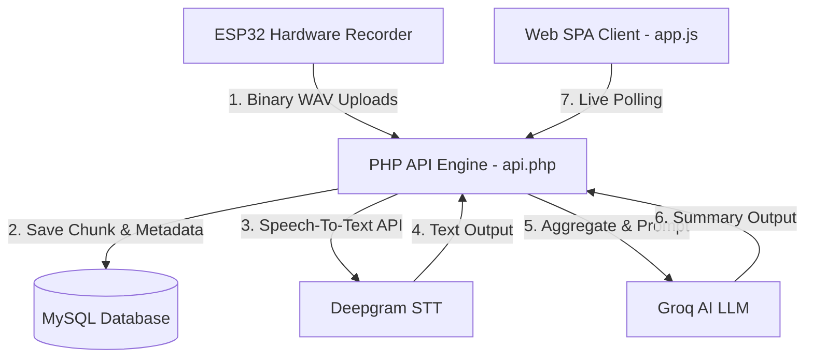

# MythBrain Architectural Walkthrough

MythBrain is a hybrid hardware-software system designed for real-time meeting recording, transcription, and AI summarization. Below is a detailed analysis of how the entire ecosystem operates under the hood.

---

## 1. System Overview

The system is split into four primary layers:
1. **IoT Hardware Layer (ESP32)**: Handheld device capturing audio chunks and streaming them to the server.
2. **Server API Layer (`api.php`)**: Processes uploads, calls AI services, manages database states, and handles user authentication.
3. **AI Layer (Deepgram & Groq)**: Transcribes speech (with mixed English/Bengali support) and synthesizes summaries.
4. **Web UI Layer (`app.js`)**: Single Page Application (SPA) displaying recordings, real-time transcription progress, settings, and PDF downloads.

---

## 2. ESP32 Audio Pipeline
The hardware recorder uses an ESP32 microcontroller paired with an I2S microphone (e.g., INMP441) to capture audio.

- **Audio Capture Configuration**: Audio is sampled at **16kHz, 16-bit depth, mono channel**, which is the optimal profile for speech recognition.
- **Audio Chunking**: Instead of recording one massive file, the ESP32 divides the audio into small **binary WAV chunks (typically 10 to 15 seconds long)**. 
- **Binary Queue & Uploads**:
  - The ESP32 streams the current chunk to memory while uploading the previous chunk in the background via HTTP POST requests to:
    `api.php?action=esp_upload_chunk&token=<DEVICE_TOKEN>&chunk_number=<NUM>`
  - Chunks are transmitted in pure binary format inside the HTTP request body.
  - If a chunk upload fails due to network instability, the ESP32 holds it in a local buffer queue and retries.

---

## 3. Server-Side PHP API Pipeline (`api.php`)
The backend is a lightweight, high-performance PHP script routing requests through specific action handlers:

### A. Chunk Processing & Transcription
When a WAV chunk is received from the hardware:
1. The server reads the raw input stream and saves the binary file to `uploads/chunks/<recording_id>_<chunk_number>.wav`.
2. A database entry is created in `recording_chunks` to trace the chunk's relationship to the active recording.
3. The server immediately forwards the WAV file binary to the **Deepgram API** for transcription using the **Nova-3** engine. 
4. The transcription result is saved to the database.
5. The global transcript of the recording is automatically updated by concatenating all transcribed chunks sequentially.

### B. Safe Sync Pipeline (Finishing State)
To ensure no chunks are lost when the user stops a recording:
1. When the user clicks "Stop" in the Web App, the frontend requests `api.php?action=stop_recording`.
2. The server changes the status of the recording to **`'finishing'`** rather than `'completed'`.
3. While in the `'finishing'` state, the API accepts the remaining WAV chunks still queued in the ESP32's buffer.
4. Once the ESP32 has verified that its local queue is empty, it makes a final call to:
   `api.php?action=esp_complete_recording`
   This safely flags the recording status as **`'completed'`**, preventing 404 upload failures for final in-flight chunks.

---

## 4. On-Demand AI Summary & Speech-To-Text
To save API costs and speed up layout performance, the AI summary is generated **on-demand** when the user opens the Summary panel for the first time.

- **STT Nova-3 Fallback (`multi`)**: By setting the Deepgram transcription fallback language parameter to `multi`, the system handles code-switching (bilingual speech switching naturally between English and Bengali phrases) out-of-the-box.
- **Claude-Style Prompting**: When the user opens the Summary panel, the frontend calls the Groq summary endpoint. The system runs the entire consolidated transcript through the configured Groq LLM (e.g., Llama 3.3 70B) with instructions to generate:
  - High-level synopsis
  - Categorized Bulleted Action Items
  - Key Decisions Made
- **Prompt Formatting**: Groq is instructed to return structured HTML tags (like `<h3>`, `
`, and `<ul>`/`<li>`) directly, resulting in beautiful layouts without requiring heavy client-side markdown parsing.

---

## 5. Web Single Page Application (SPA)
The front-end is written in vanilla ES6 Javascript (`app.js`) and styled with raw CSS (`style.css`), relying on hash routing (`#home`, `#dashboard`, `#memory`, `#settings`).

- **Real-Time Polling**: While a recording is in progress or finishing, the client page polls the server status at short intervals to update the chunk timeline and real-time transcripts.
- **Responsive Accordion Smart Toggles**: On mobile and tablet views, the Details modal uses a smart toggle handler:
  - Opening the **AI Summary** panel automatically collapses the **Full Transcript** panel.
  - Minimizing the **AI Summary** panel automatically re-expands the **Full Transcript** panel.
- **Dynamic PDF Generator**: Clicking the Download PDF button triggers client-side jsPDF rendering. 
  - The script cleans carriage returns (`\r`), segments headers, body text, and lists, and automatically flows them across pages with running headers, eliminating spacing issues and right-margin text cutoffs.

---

## 6. Database Schema Overview
The database `ashikone_mythbraindb` tracks five tables:
1. **`users`**: Manages auth details, password hashes, and registration tokens.
2. **`user_settings`**: Stores Deepgram/Groq API keys, preferred LLM models, and aggregated system consumption tokens.
3. **`devices`**: Links hardware token credentials and handles active recording states and provisioning.
4. **`recordings`**: Tracks active and past sessions with titles, durations, statuses, transcripts, and cached summaries.
5. **`recording_chunks`**: Tracks individual WAV file paths and local transcripts for each chunk uploaded.
